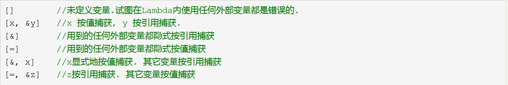

# 1. 特性

## 1.1. typeof
typeof 获取一个变量的类型
```c++
int a = 1;
typeof(a) b = 2; //获取变量a的类型，定义变量b
```

## 1.2. typeid
typeid 返回一个变量类型的字符串
```C++
typeid(var).name()
```

## 1.3. main函数中参数使用
```C++
#include <stdio.h>
int main(int argc, char *argv[]){
    int i;
    printf("The program receives %d parameters:\n", argc);
    for(i=0; i<argc; i++){
        printf("%s\n", argv[i]);
    }
    return 0;
}
```

内联函数
```C++
inline int Max(int a,int b)
{
    return a > b ? a : b;
}
```

默认参数
`请将默认参数放在参数列表的最后一个`
```C++
void func(int n, float b=1.2, char c='@'){
    cout<<n<<", "<<b<<", "<<c<<endl;
}
```

函数重载
函数的重载的规则：

- 函数名称必须相同。
- 参数列表必须不同（个数不同、类型不同、参数排列顺序不同等）。
- 函数的返回类型可以相同也可以不相同。
- 仅仅返回类型不同不足以成为函数的重载。

C++代码在编译会根据参数列表对函数进行重命名，例如`void Swap(int a, int b)`，会被重命名为`_Swap_int_int`，`void Swap(float x, float y)` 会被重新命名为`_Swap_float_float`


| 优先级                 | 包含的内容             | 举例说明                                                     |
| ---------------------- | ---------------------- | ------------------------------------------------------------ |
| 精确匹配               | 不做类型转换，直接匹配 | （暂无说明）                                                 |
|                        | 只是做微不足道的转换   | 从数组名到数组指针、从函数名到指向函数的指针、从非 const 类型到 const 类型。 |
| 类型提升后匹配         | 整型提升               | 从 bool、char、short 提升为 int，或者从 char16_t、char32_t、wchar_t 提升为 int、long、long long。 |
|                        | 小数提升               | 从 float 提升为 double。                                     |
| 使用自动类型转换后匹配 | 整型转换               | 从 char 到 long、short 到 long、int 到 short、long 到 char。 |
|                        | 小数转换               | 从 double 到 float。                                         |
|                        | 整数和小数转换         | 从 int 到 double、short 到 float、float 到 int、double 到 long。 |
|                        | 指针转换               | 从 int * 到 void *。                                         |


## lambda表达式
`没有名字的函数`

```
[=](int x, int y) -> bool { return x%10 < y%10; }

[&](int & x) { total += x; x *= 2; }
```




## explicit
`禁止单参数构造函数被隐式转换`
```
#include <iostream>

using namespace std;

class A
{
public:
    A()  {}
    A(int a) {}
    A(char a,int b = 1) {}
    A(int a, char b) {}
    A(int a, int b, int c = 2) {}
    ~A() {}
};

int main()
{
    A a;   //无参构造函数
    A b(1); //调用A(int a) {}
    A c = 1; //调用A(int a) {},C++编译器针对只有一个参数的构造函数，会隐式类型转换,通过右值类型直接调用参数类型相同（排除默认参数的构造函数也是符合的）的构造函数
    A d(1, 2); //A(int a, int b, int c = 2) {}
    A e = 'A'; // A(char a,int b = 1) {} 这里也是隐式类型转化
    return 0;

}
```
针对隐式类型转化，我们可以通过关键字explicit修饰构造函数，这样定义类变量时，只能显示的调用构造函数才能定义变量，
*例如*：explicit A(char a,int b = 1)；

## const

const修饰的成员变量，只能通过列表初始化
```
#include <iostream>

using namespace std;

class demo
{
public:
    demo(int a,int b): b(b) //成员变量b只能这样赋值
    {
        this->a = a;
}

    int a;
    const int b;
};
int main()
{
    demo A(1,2);
    cout << A.a << endl;
    cout << A.b << endl;
    return 0;
}
```