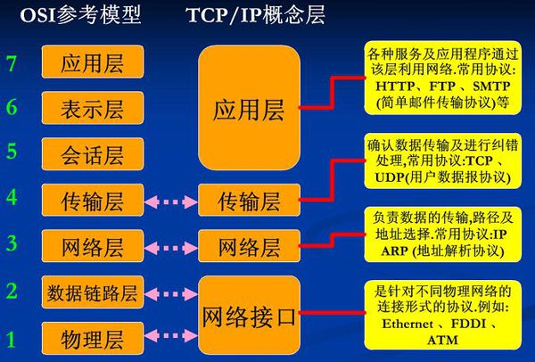

# 网络编程
## socket
socket被翻译为套接字，它是计算机之间进行通信的一种方式，通过socket这种约束，一台计算机可以接收其他计算机的数据，也可以向其他计算机发送数据

### 套接字的分类
1 流格式套接字(SOCK_STREAM)
SOCK_STREAM 是一种可靠的、双向的通信数据流，数据可以准确无误地到达另一台计算机，如果损坏或丢失，可以重新发送。

数据在传输过程中不会消失
数据是按照顺序传输的
数据的发送和接收不是同步的 (流式套接字内部有一个缓存区，接收端不一定第一时间就去获取数据，而是等待缓存区的满了才去读取，也可以分为几次读取)

它是使用的TCP协议的

#### 应用：
http

### 数据报格式套接字（SOCK_DGRAM）
`无连接的套接字`
计算机只管传输数据，不管数据校验，如果数据在传输过程中损坏，或者没有达到另一台计算机，是没有办法补救的，数据错了就无法重传的

特点：
- 强调快速传输而非传输顺序
- 传输的数据可能丢失也可能损坏
- 限制每次传输的数据大小
- 数据的发送和接收是同步到

它是使用utp协议的

应用：
QQ 视频聊天和语音聊天就使用 SOCK_DGRAM 来传输数据，因为首先要保证通信的效率，尽量减小延迟，而数据的正确性是次要的，即使丢失很小的一部分数据，视频和音频也可以正常解析，最多出现噪点或杂音，不会对通信质量有实质的影响。

`注意：SOCK_DGRAM没有你想像那么糟糕，不会频繁的丢失数据，数据错误只是小概率事件`

OSI网络七层模型

## IP地址
每一台计算机拥有独立的ip地址

一个局域网也可以拥有一个独立的ip地址

由于ipv4的ip地址不够用，往往是一个局域网才拥有一个ip地址

## MAC地址

由于往往是一个局域网才有一个独立的ip地址，所有通过ip地址只能定位到一个局域网，无法定位到具体的计算机，
所有真正标识一台计算机是 MAC地址，每个网卡的MAC地址在全世界是独一无二的，局域网中路由器或者交换机会记录范围内的每一台计算机的MAC地址

## 端口号

通过端口号可以定位是数据是发给哪个应用的

服务端流程：
- 创建套接字
- 设置ip地址和端口
- 将套接字和ip端口信息绑定
- 监听套接字
- 接收客服端