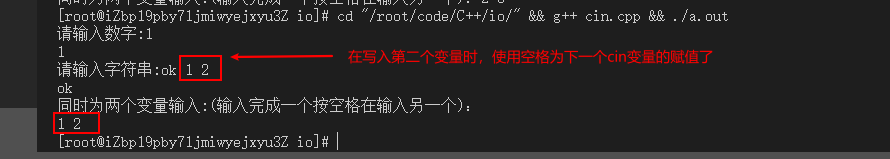

# 输入和输出
```
#include <iostream>

using namespace std;

int main(int argc, char const *argv[])
{
    int a;
    cout << "请输入数字:";
    cin >> a;
    cout << a << endl; //如果输入的非数字，变量的值为0

    char sz[20];
    cout << "请输入字符串:";
    cin >> sz;
    cout << sz << endl; //输入字符串没有问题

    int c,d;
    cout << "同时为两个变量输入:(输入完成一个按空格在输入另一个)：";
    cin >> c >> d;

    cout << c << " " << d << endl;
    return 0;

}
```


1. 如果针对数值变量，输入非数字，会被赋值为0
2. 输入字符串，遇到`空格`表示完成输入，空格后面的输入会给下个变量

## 输入
```
#include <iostream>

using namespace std;

int main(int argc, char const *argv[])
{
    cout << "hello world";  //不换行
    cout << "\n"; //换行
    cout << endl; // 换行
    cout << "xxxx" << "11111" << endl; //拼接输出
    cout << "????" 
         "oooo"
         "qqqq" << endl; //针对这样输出字符串，还是会拼接的
    return 0;
}

```