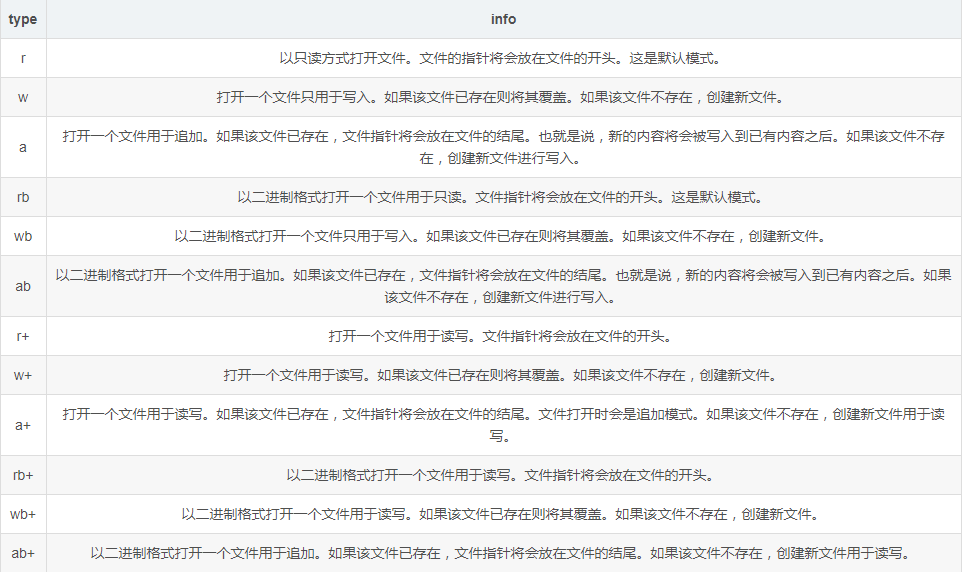

# 文件处理
打开文件



```python
#以只读的方式打开文件，文件不存在会报错
f = open(path,'r') 
f.read() #读取文件
f.close() #操作完文件请注意关闭文件
```

```python
#打开文件,只能进行写入，存在则覆盖，不存在则创建，不能读
f = open(path,'w') 
f.write('yuandongbin1')
```

```python
#打开文件用于追加写入的，存在则结尾，不存在则创建，不能读
f = open(path,'a') 
f.write('yuandongbin1')
```
```
#以二进制格式打开一个文件只用于写入。不能读
f = open(path,'wb')
```
```
#以二进制格式打开一个文件只用于追加，不能读
f = open(path,'ab')
```
```
# 打开一个文件用于读写。文件指针将会放在文件的开头，不存在会报错
open(path,'r+')
```
```
# 打开文件用于读写。存在则覆盖，不存在则创建
open(path,'w+')
```
```
# 打开文件用于读写，文件存在，文件指针放在结尾，存在就会追加，文件不存在，会创建
open(path,'a+')
```

```
# 以二进制打开一个文件用于读写，指针在文件前
open(path,'rb+')
```
```
# 以二进制打开一个文件用于读写，存在则覆盖，不存在则创建
open(path,'wb+')
```
```
# 以二进制打开一个文件用于追加，指针在文件结尾，存在则追加，不存在则创建
open(path,'ab+')
```


创建文件夹
```

```

创建文件
```python


```


判断文件或者文件夹是否存在
```python
import os
print(os.path.exists(path))    #存在返回True，否在Flase
```