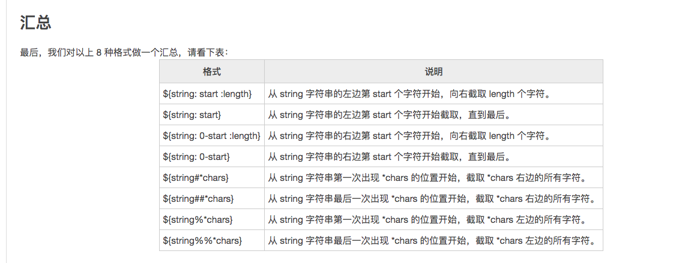

# 字符串
定义字符串
```shell
str1=www.yuandongbin.xyz  #这种方式定义的字符串不能有空格，否则空格后边的字符串会作为其他变量或者命令解析
str2="shell script"
str3='中文'
```

```shell
#!/bin/bash
n=74
str1=www.yuandongbin.xyz$n str2="shell \"script\" $n"
str3='中文 $n'
echo $str1
echo $str2
echo $str3
echo "str1字符串的长度为${#str1}"
```

获取字符串的长度
```shell
${#string_name}
```

字符串的拼接
```shell
#!/bin/bash
name="Shell"
url="http://c.biancheng.net/shell/"
str1=$name$url  #中间不能有空格
str2="$name $url"  #如果被双引号包围，那么中间可以有空格
str3=$name": "$url  #中间可以出现别的字符串
str4="$name: $url"  #这样写也可以
str5="${name}Script: ${url}index.html"  #这个时候需要给变量名加上大括号
echo $str1
echo $str2
echo $str3
echo $str4
echo $str5
```
`{}`可以帮助解释器识别变量的边界

字符串的截取
```shell
${string: start :length}
```

从字符串左边开始计数
```shell
url="c.biancheng.net"
echo ${url: 2: 9}
```

```shell
url="c.biancheng.net"
echo ${url: 2}  #省略 length，截取到字符串末尾
```

从右边开始计数

```shell
${string: 0-start :length}  #这里的0是固定写法，说明起始数字从0开始
```

```shell
url="c.biancheng.net"
echo ${url: 0-13}  #省略 length，直接截取到字符串末尾

# 从右边向左边截取13个字符
```shell

从指定字符（子字符串）开始截取

1.使用#号截取右边字符
```shell
${string#*chars}
```

```shell
url="http://c.biancheng.net/index.html"
echo ${url#*:} # 即截取：右边的字符
echo ${url#*p:}
echo ${url#*ttp:}
echo ${url#http:}
# 这几种结果是一样的
```

希望知道最后一个指定字符（子字符串）再匹配结束，那么可以使用`##`
```shell
${string##*chars}
```

```shell
#!/bin/bash
url="http://c.biancheng.net/index.html"
echo ${url#*/}    #结果为 /c.biancheng.net/index.html
echo ${url##*/}   #结果为 index.html
str="---aa+++aa@@@"
echo ${str#*aa}   #结果为 +++aa@@@
echo ${str##*aa}  #结果为 @@@
```

使用%截取左边的字符

```shell
${string%chars*}
```

```shell
#!/bin/bash
url="http://c.biancheng.net/index.html"
echo ${url%/*}  #结果为 http://c.biancheng.net
echo ${url%%/*}  #结果为 http:
str="---aa+++aa@@@"
echo ${str%aa*}  #结果为 ---aa+++
echo ${str%%aa*}  #结果为 ---
```



