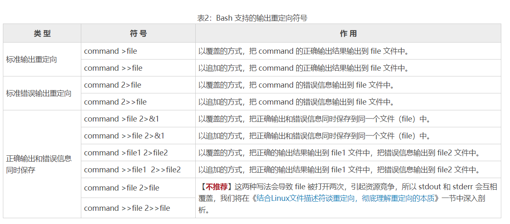

# 重定向


## 输出重定向



## 输入重定向

| 符号                  | 说明                                                         |
| --------------------- | ------------------------------------------------------------ |
| command <file         | 将 file 文件中的内容作为 command 的输入。                    |
| command <<END         | 从标准输入（键盘）中读取数据，直到遇见分界符 END 才停止（分界符可以是任意的字符串，用户自己定义）。 |
| command <file1 >file2 | 将 file1 作为 command 的输入，并将 command 的处理结果输出到 file2。 |


统计文件有多少行

```shell
wc -l < test.txt
```


统计用户在终端中输入文本的行数

```
wc -l <<END # 当用户输入END执行结束
```

