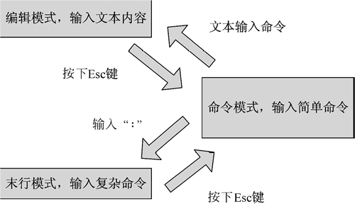

# vim
命令模式

编辑模式

末行模式


## 修改
insert
i：在光标之前插入
l：在行首插入

add to
a：在光标之后插入
A：在行尾插入

o：在光标下方新建一行，并将光标置于该行的行首
O：在光标上方新建一行，并将光标置于该行的行首

## 删除
x：删除光标处的字符
X：删除光标前面的字符
dd：删除光标所在的整行
D或d$：删除从光标所在处开始到行尾的内容
d0：删除从光标前一个字符开始到行首的内容
dw：删除一个单词
d( 命令：该命令删除到上一句开始的所有字符。
d) 命令：该命令删除到下一句开始的所有字符。
d} 命令：该命令删除到上一段开始的所有字符。
d{ 命令：该命令删除到下一段开始的所有字符。
d<CR> 命令：该命令（<CR>表示回车）删除包括当前行在内的两行字符。

## 复制
复制整行 yy
复制从光标到行尾的内容
复制一个单词 yw
复制到下句开始的所有字符 y)
复制下一段开始的所有字符y}
复制包括当前行内的两行内容 y\<CR\>

## 粘贴
p 粘贴当前缓存区的内容、

## 文本选择
v 在命令模式下，进行文本选择，移动光标选择文本
V 在命令模式下，按行进行文本选择

## 撤销命令
u 撤销上次的操作
U 一次性撤销自上次移动到当前行以来做过的所有操作

## 重复操作
`.` 重复最近的一次操作

## 退出
```
:q
:q!
:w
:wq
:w!
:x
```

## 替换
r 安装字符替换
R 进入replace，每个输入的字符都会替换当前光标下的字符

## 移动光标
j 上
k 下
h 左
l 右

H 移动当前屏幕的第一行
4H 从文件首第一行往下第四行的位置

M 移动到屏幕中间
L 移动屏幕最底行的行首
G 无视屏幕，移动光标 4G到第四行

w 和 W 命令将光标右移至下一个字的字首
w 命令所指的字是指英文单词、标点符号和非字母字符；
W 命令所指的字是指两个空格之间的任何内容。 

 e 和 E 命令将把光标移到本字字尾
e 命令所指的字是指英文单词、标点符号和非字母字符;
E 命令所指的字是指两个空格之间的任何内容。

则 b 和 B 命令将把光标移至本字字首
b 命令所指的字是指英文单词、标点符号和非字母字符；
B 命令所指的字是指两个空格之间的任何内容。

一个段落被定义为是以一个空白行开始和结束的片段。
{ 命令：该命令将光标向前移动至
} 命令：该命令将光标向后移至下一个段落的开头。

`>` 
`>4`

`>>`
`4>>`

`<`
`4<`

`<<`
`4<<`

## 跨行移动
```
imj
```
`5m2` 将第5行的内容移动到第2行下面


| 滚屏和分页命令 |            	命令意义             |
| ------------- | --------------------------------- |
| Ctrl+u        | 	将屏幕向前（文件头方向）翻滚半屏 |
| Ctrl+d        | 	将屏幕向后（文件尾方向）翻滚半屏 |
| Ctrl+f        | 	将屏幕向文件尾方向翻滚一整屏     |
| Ctrl+b        | 	将屏幕向文件首方向翻滚一整屏     |

## 查找

```
/string #/命令从光标处开始向后寻找字符串 string。
```

```
?string # ? 命令从光标处开始向前寻找字符串 string。
```

n 重复上一条检索命令
N 重复上一条检索命令，但是检索方向改变

g/ 命令使光标停止在第一个检索到的string串的行首。

替换命令
```
[range]s/s1/s2/ [option]
```
- [range] 表示检索范围，省略时表示当前行。下面是一些检索范围的例子。
    - 1,10表示从第 1 行到 10 行。
    - %表示整个文件，同1, $。
    - . ,$从当前行到文件尾。
- s为替换命令
- s1要被替换的串，s2为替换的串
- option表示选项
    - `/g`表示在全局文件中进行替换
    - `/c`表示在每次替换之前需要用户进行确认
    - 省略时仅对每行第一个匹配串进行替换
